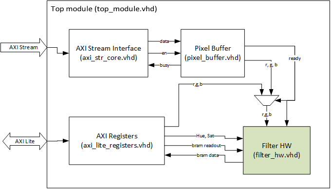

# ITIV -- DHL feature extraction project

## Folder structure
- ci: continious integration for the student code checker
- constraints: Vivados constraint files
- hdl: contains the solution hdl code of the feature extration IP core
- ip\_ressources: helper IP cores for the ZedBoard; HDMI core etc, mostly provided by Analog Devices
- testbenches: testbenches for the students
- vivado\_project: TCL scripts to create a Vivado project

**Do not edit the testbenches, the files in "ci" and the file ".gitlab-ci.yml" without consulting the lab supervisors. Normally, these files do not need to be changed.**

## General information about the IP core

Apart from the picture given in the student documentation there are more IP
blocks to be taken into account when changes to the IP core structure are made.
The `filter_hw`, which is the to the students visible top module, is actually
embedded into an other top module, called `top_module.vhd` (how obvious...). The
following overview will give you a glimse of the structure:

Data input is realized via AXI Stream. An AXI Stream interface module takes care
of handling the interface. Then the the data is buffered in a pixel buffer
module. This implements a FIFO cell. Moreover, it takes care of the data
arbitration. Since the 32-bit data input stream is aligned in the following
order, it has to be realigned in order to extract the R, G and B values
accordingly:
~~~~~
R G B R
G B R G
B R G B
R G B R
~~~~~
Before the data is passed to the filter\_hw module a mux decides wheather the
RGB data from the input registers or from the AXI stream is used. This is done
depending on the pixel buffers ready signal, which is asserted when data from
the pixel buffer is available.

The IP core is accessable from the processing system via a set of registers and
an AXI lite interface. It features 15 registers to control the IP core, read the
status and also to read the detected features. The following table gives an
overview of the registers available:

| Name                            | Mode | Address (Base + x)   | Byte 3              | Byte 2                        | Byte 1             | Byte 0                |
| ------------------------------- | ---- | -------------------- | ------------------- | ------------------            | ------------------ | ------------------    |
| Status Control                  | RW   | 0x00                 | Bit 31: HIGH        | Bit 16: reset (self clearing) |                    | Bit0: idle            |
|                                 |      |                      |                     |                               |                    | Bit1: Pipeline enable |
| Pixel Data (manual override)    | W    | 0x04                 | -                   | B                             | G                  | R                     |
| H1 Max/Min                      | RW   | 0x08                 | h\_max              |                               | h\_min             |                       |
| H2 Max/Min                      | RW   | 0x0C                 | h\_max              |                               | h\_min             |                       |
| S1 Max/Min                      | RW   | 0x10                 | -                   | s\_max                        | -                  | s\_min                |
| S2 Max/Min                      | RW   | 0x14                 | -                   | s\_max                        | -                  | s\_min                |
| Readout Status                  | R    | 0x18                 | Bit31: valid\_2     | count\_2                      | Bit15: valid\_1    | count\_1              |
|                                 |      |                      | Bit26-24: count\_2  |                               | Bit10-8: count\_1  |                       |
| Readout Region 1 Addr           | RW   | 0x1C                 | -                   | Bit 16: readout enable        | Read\_Addr         |                       |
| Readout Region 1 Left Right     | R    | 0x20                 | Left\_Border        |                               | Right\_Border      |                       |
| Readout Region 1 Upper Lower    | R    | 0x24                 | Upper\_Border       |                               | Lower\_Border      |                       |
| Readout Region 2 Addr           | RW   | 0x28                 | -                   | Bit 16: readout enable        | Read\_Addr         |                       |
| Readout Region 2 Left Right     | R    | 0x2C                 | Left\_Border        |                               | Right\_Border      |                       |
| Readout Region 2 Upper Lower    | R    | 0x30                 | Upper\_Border       |                               | Lower\_Border      |                       |

## General information about the visualization tool

### Keycodes when running the visualization software in the Zedboard Linux
- Right mouse click: Set Hue1 and Sat1 from the pixel clicked on the frame
- Left mouse click: Set Hue2 and Sat2 from the pixel clicked on the frame
- 1: RGB view mode
- 2: Hue1 view mode (Only for feature calculation without IP core)
- 3: Sat1 view mode (Only for feature calculation without IP core)
- 4: Hue2 view mode (Only for feature calculation without IP core)
- 5: Sat2 view mode (Only for feature calculation without IP core)
- 6: Hue1 and Sat1 view mode (Only for feature calculation without IP core)
- 7: Hue2 and Sat2 view mode (Only for feature calculation without IP core)
    - 8: Grayscale view mode
    - 9: Edge detection view mode
    - 0: Print registers of
    - q: Reset Hue1 / Sat1 to standard value
    - w: Reset Hue2 / Sat2 to standard value
    - y: Set step for Hue / Sat value change to 1
    - x: Set step for Hue / Sat value change to 4
    - c: Set step for Hue / Sat value change to 16
- r: Change Hue / Sat radius (Not fully understand now ...)
    - d: Toggle display of framerate on the console
    - i: Print Hue / Sat values
    - Up / Down: Increase / Decrease Hue, Sat center value (depending on the view mode; Only for feature calculation without IP core)
    - Left / Right: Increase / Decrease Hue, Sat radius value (depending on the view mode; Only for feature calculation without IP core)

